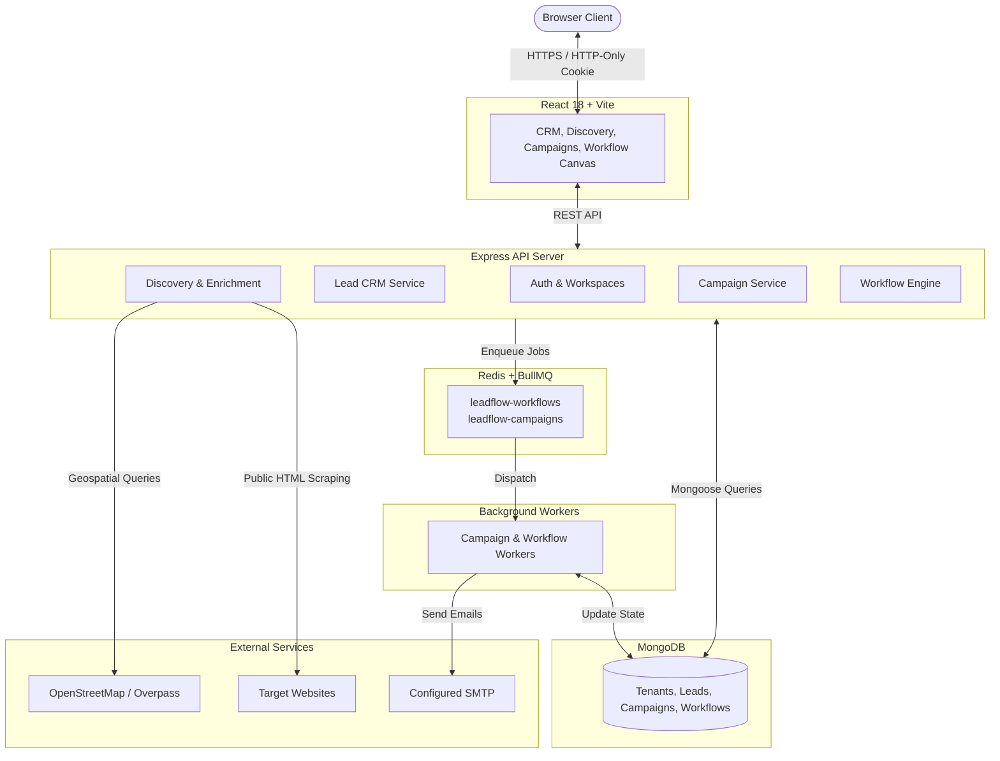
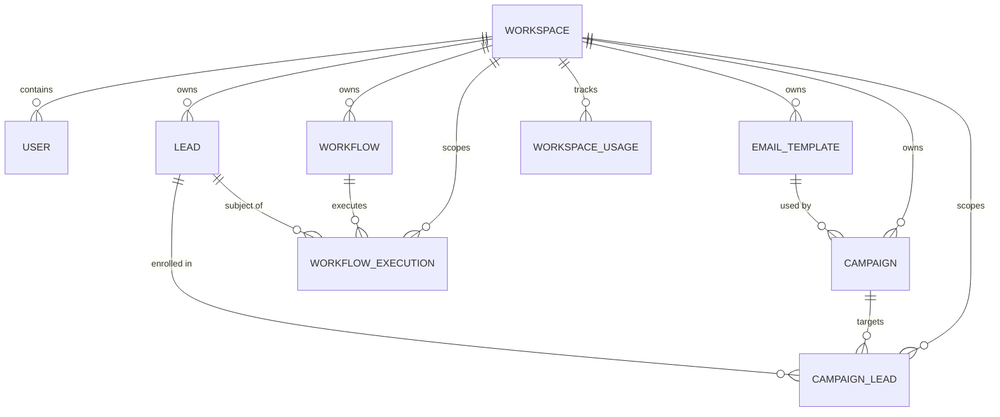

# LeadFlow — Omnichannel Lead Generation, CRM & Workflow Automation Platform

[]()
[]()
[]()
[]()

LeadFlow is an enterprise-ready, omnichannel lead generation, CRM, and workflow automation platform. Built with a modern TypeScript stack, it empowers sales and marketing teams to discover prospective businesses, enrich them with verified contact data, organize pipelines, dispatch email campaigns asynchronously, and automate follow-ups using a visual workflow engine.

---

## Documentation Navigation
- 📖 [Technical Documentation (Complete Manual)](./docs/TECHNICAL_DOCUMENTATION.md)
- 🏗️ [System Architecture & Data Flows](./docs/ARCHITECTURE.md)
- 🗄️ [Entity Relationship (ER) & Database Design](./docs/ER_DIAGRAM.md)

---

## 1. Project Overview

LeadFlow bridges the gap between disparate prospecting tools, CRM databases, email outreach systems, and workflow engines into a unified platform.

### The Complete User Journey
```text
  [1. Discover Prospects]
           │ Natural language search (OpenStreetMap Nominatim / Overpass POI / Optional Apify)
           ▼
  [2. Enrich Business Data]
           │ SSRF-safe public website scanning (Emails, Phones, Official Socials, Provenance)
           ▼
  [3. Save as CRM Leads]
           │ 1-click conversion with deduplication and multi-tenant workspace isolation
           ▼
  [4. Organize & Triage Leads]
           │ Search, pipeline stages, priority filters, bulk updates, and CSV import/export
           ▼
  [5. Create Email Templates]
           │ Reusable HTML/text templates with validated placeholders ({{firstName}}, etc.)
           ▼
  [6. Launch Outreach Campaigns]
           │ Batch lead enrollment and asynchronous background dispatch (HTTP 202 Accepted)
           ▼
  [7. Visual Workflow Automation]
           │ Drag-and-drop React Flow builder executing condition branches and automated actions
```

---

## 2. Key Features

### Authentication & Multi-Tenancy
- **Secure Sessions**: Stateless JSON Web Tokens (JWT) stored in HTTP-only, `SameSite=Lax` cookies. Passwords hashed using `bcryptjs` (12 rounds).
- **Workspace Isolation**: Every user, lead, template, campaign, and workflow belongs to a `Workspace`. Cross-tenant data leakage is strictly prevented at the database query layer.

### Lead Discovery Engine
- **Free Geospatial Discovery**: Integrated with **OpenStreetMap Nominatim** and the **Overpass API** (`DISCOVERY_PROVIDER=osm_combined`) for real-world POI discovery under the ODbL 1.0 license.
- **Authentic Listings**: Zero data fabrication. If a phone number or email is not present on the listing, it is returned as `undefined`.
- **Optional Apify Google Maps Integration**: Protected by a two-tier cost defense mechanism (atomic per-workspace daily rate limiting + session ceiling). If quota is exceeded, returns HTTP 429 without silent provider substitution.

### Website-Based Prospect Enrichment
- **SSRF-Guarded Web Fetching**: Validates outbound URLs against private IP ranges (`10.0.0.0/8`, `192.168.0.0/16`), loopback addresses, and cloud metadata endpoints (`169.254.169.254`).
- **Bounded Resource Usage**: 7-second abort timeout, 2MB payload ceiling, max 3 redirects.
- **Contact & Social Extraction**: Extracts public `mailto:` links, telephone numbers, and official published links to LinkedIn, Facebook, Instagram, X/Twitter, YouTube, and GitHub.
- **Field-Level Provenance**: Every attribute tracks its origin (`source: "openstreetmap"` vs `source: "website"`) with UI badges.

### Lead Management & CRM
- **Pipeline Stages**: `new`, `contacted`, `qualified`, `converted`, `lost`.
- **Triage & Search**: Priority filtering (`low`, `medium`, `high`), real-time search, and deterministic pagination.
- **Bulk Operations**: Multi-select bulk status updates, bulk archiving, and bulk deletions.
- **CSV Data Mobility**: Full CSV import with automatic column header mapping and RFC 4180 compliant CSV export.

### Reusable Email Templates
- **Template Builder**: Dynamic HTML and plain text email templates.
- **Variable Inspection**: Strictly whitelists allowed template placeholders (`{{firstName}}`, `{{lastName}}`, `{{email}}`, `{{company}}`, `{{phone}}`, `{{source}}`, `{{status}}`, `{{priority}}`). Unknown variables are rejected during creation.

### Outreach Campaigns & Asynchronous Dispatch
- **Cohort Association**: Link cohorts of leads to a campaign via a dedicated `CampaignLead` junction collection with unique constraints.
- **Asynchronous Execution (HTTP 202)**: Campaign launches enqueue individual delivery jobs into Redis/BullMQ and return immediately.
- **Telemetry & Monitoring**: Live tracking of sent, pending, and failed deliveries with sanitized error logs.

### Visual Workflow Automation Engine
- **Visual Graph Editor**: Node-based automation canvas powered by `@xyflow/react`.
- **DAG Topology Validation**: Backend Depth-First Search (DFS) rejects cycles, orphaned nodes, and ensures exactly one trigger exists.
- **Condition Branching**: Evaluates lead fields against operators (`equals`, `not_equals`, `contains`, `not_contains`, `exists`, `not_exists`) routing to `yes` or `no` handles.
- **Automated Actions**: Send personalized emails via SMTP or synchronously update lead attributes in MongoDB.

### Background Queueing & Infrastructure
- **Redis + BullMQ**: Dedicated worker processes (`workflow.worker.ts` and `campaign.worker.ts`) handling asynchronous queues.
- **Bounded Retries**: 3 attempts with exponential backoff (`delay: 1000ms`).
- **Delivery Idempotency**: Guarantees that retried jobs never re-send duplicate emails.
- **Resilient Startup**: Express boots cleanly even if Redis or SMTP are temporarily offline.

---

## 3. Technology Stack

| Layer | Technologies | Rationale |
| :--- | :--- | :--- |
| **Frontend UI** | React 18, TypeScript, Vite, `@xyflow/react` | Type-safe, high-performance SPA with interactive drag-and-drop workflow canvas. |
| **Backend API** | Node.js 20+, Express 4, TypeScript | Scalable RESTful API with strict compile-time type safety. |
| **Database** | MongoDB 6.0+, Mongoose 8+ | Document store with multi-tenant compound indexes and soft-delete support. |
| **Authentication** | JWT, `bcryptjs`, HTTP-Only Cookies | Stateless, secure authentication resistant to XSS and token exfiltration. |
| **Job Queue** | Redis 6.2+, BullMQ 6+ | Production-grade distributed queueing with retry policies and job concurrency. |
| **Email Delivery** | Nodemailer, SMTP | Abstracted provider layer (`IEmailProvider`) with strict TLS verification. |
| **Discovery** | OpenStreetMap Nominatim, Overpass API | ₹0 cost, open-data geospatial discovery under ODbL 1.0 license. |
| **Enrichment** | Native `fetch`, Node.js `dns` | Custom SSRF-safe HTML parser extracting public contact information. |

---

## 4. Architecture Diagram



### ASCII Architecture Representation
```text
  +-------------------------------------------------------------------------+
  |               React 18 + Vite Frontend (Port 5173)                      |
  |     Leads CRM  |  Discovery Engine  |  Campaigns  |  Workflow Canvas   |
  +-------------------------------------------------------------------------+
                                       │
                      HTTPS Requests / HTTP-Only Cookie
                                       ▼
  +-------------------------------------------------------------------------+
  |                   Express API Server (Port 5000)                        |
  |   Auth Controller  |  Lead Service  |  Campaign Service  |  Workflow    |
  +-------------------------------------------------------------------------+
          │                                                  │
   CRUD Operations                                    Enqueue Jobs
          ▼                                                  ▼
  +-----------------------+                          +-----------------------+
  |        MongoDB        |                          |     Redis / BullMQ    |
  |  (Tenants, Leads,     |                          | (leadflow-workflows,  |
  |   Campaigns, Graphs)  |                          |  leadflow-campaigns)  |
  +-----------------------+                          +-----------------------+
          ▲                                                  │
          │                                            Consume Jobs
          │                                                  ▼
          │                          +---------------------------------------+
          └──────────────────────────|         Background Worker Pool        |
                                     |  - Campaign Worker (Async Dispatch)   |
                                     |  - Workflow Worker (DAG Execution)    |
                                     +---------------------------------------+
                                                         │
                                                  Deliver Messages
                                                         ▼
                                            +-------------------------+
                                            |  Configured SMTP Relay  |
                                            +-------------------------+
```

---

## 5. Entity Relationship (ER) Summary



### ASCII ER Diagram
```text
  +-------------+       1:N       +-------------+
  |  Workspace  |---------------->|    User     |
  +-------------+                 +-------------+
         │
         │ 1:N
         ├───────────────────────>+-------------+       1:N       +---------------+
         │                        |    Lead     |---------------->| CampaignLead  |
         │                        +-------------+                 +---------------+
         │ 1:N                                                           │
         ├───────────────────────>+---------------+                      │
         │                        | EmailTemplate |                      │
         │                        +---------------+                      │
         │                               │                               │
         │ 1:N                           │ 1:N                           │ N:1
         ├───────────────────────>+---------------+                      │
         │                        |   Campaign    |----------------──────┘
         │                        +---------------+
         │ 1:N
         ├───────────────────────>+---------------+       1:N       +-------------------+
         │                        |   Workflow    |---------------->| WorkflowExecution |
         │                        +---------------+                 +-------------------+
         │ 1:N
         └───────────────────────>+---------------+
                                  |WorkspaceUsage |
                                  +---------------+
```
*For complete schema attributes, constraints, and compound indexes, refer to [`docs/ER_DIAGRAM.md`](./docs/ER_DIAGRAM.md).*

---

## 6. External Services & Cost Considerations

LeadFlow V1 is deliberately architected around a **Free-First Philosophy**:
- **Default Real Discovery**: Uses OpenStreetMap Nominatim and public Overpass API instances (100% free under ODbL 1.0).
- **Default Contact Enrichment**: Scrapes and parses public HTML directly from target company websites (100% free; requires no external enrichment credits).
- **Local Infrastructure**: Redis and MongoDB run locally or on free cloud tiers (MongoDB Atlas M0, Redis Cloud 30MB free tier).
- **Email Delivery**: Uses standard SMTP. Can be tested for free using Mailtrap, Gmail SMTP, or local MailHog.

### Policy on Paid Third-Party Services
LeadFlow will **never** silently integrate paid third-party services. Prior to introducing any commercial API (e.g. Apollo, ZoomInfo, Google Places, SendGrid Pro):
1. Identify the concrete business requirement.
2. Document why existing open/free approaches are insufficient.
3. Evaluate pricing, quotas, and licensing constraints.
4. Present a formal proposal to stakeholders and obtain explicit approval.

*Distinction*: Public links and contact points discovered from a company's website are distinct from direct platform API access or paid lead databases.

---

## 7. Deployment Preparation

### Target Infrastructure
- **Frontend SPA**: [Vercel](https://vercel.com) or Netlify.
- **Backend API**: [Render](https://render.com), Railway, or Node.js Docker container.
- **Database**: [MongoDB Atlas](https://www.mongodb.com/atlas) M0 (Free Tier) or M10+.
- **Redis**: [Redis Cloud](https://redis.com/try-free/) or Upstash Redis.
- **Worker**: Run as a separate worker service on Render/Railway executing `npm run worker:start`.

### Environment Configuration (`server/.env.example`)
```env
PORT=5000
NODE_ENV=production
CLIENT_URL=https://your-leadflow-app.vercel.app
MONGODB_URI=mongodb+srv://<user>:<password>@cluster.mongodb.net/leadflow

JWT_SECRET=your_super_secret_jwt_key_min_32_chars
JWT_EXPIRES_IN=7d

# Optional: SMTP Configuration
EMAIL_HOST=smtp.mailtrap.io
EMAIL_PORT=587
EMAIL_SECURE=false
EMAIL_USER=your_smtp_user
EMAIL_PASSWORD=your_smtp_password
EMAIL_FROM_NAME="LeadFlow Outreach"
EMAIL_FROM_ADDRESS=outreach@yourdomain.com

# Optional: Redis Configuration (Required for Background Workers)
REDIS_HOST=your-redis-host.com
REDIS_PORT=6379
REDIS_PASSWORD=your_redis_password
REDIS_TLS=false

# Discovery Provider Configuration
DISCOVERY_PROVIDER=osm_combined
OVERPASS_BASE_URL=https://overpass-api.de/api/interpreter
OSM_USER_AGENT="LeadFlow-Discovery-Platform/1.0 (contact@yourdomain.com)"

# Optional: Apify Google Maps Configuration
APIFY_ENABLED=false
APIFY_API_TOKEN=
APIFY_ACTOR_ID=compass/crawler-google-places
APIFY_MAX_RESULTS=20
APIFY_MAX_RUNS_PER_SESSION=5
APIFY_MAX_RUNS_PER_WORKSPACE_PER_DAY=10
```

---

## 8. Local Development

### Prerequisites
- Node.js 20.x or later
- MongoDB running locally on `mongodb://127.0.0.1:27017/leadflow` (or MongoDB Atlas connection string)
- Redis running locally on `127.0.0.1:6379` (optional for web app, required for background queues)

### Quick Start
```bash
# 1. Clone repository
git clone https://github.com/anideva/LeadFlow.git
cd LeadFlow

# 2. Setup server environment
cd server
cp .env.example .env
# Edit .env with your local MongoDB URI
cd ..

# 3. Start development servers from root
npm run server:dev   # Starts backend on http://localhost:5000
npm run client:dev   # Starts frontend on http://localhost:5173

# 4. (Optional) Start background workers in server/ directory
cd server
npm run worker:dev   # Starts workflow & campaign worker with hot reload
```

### Verified Endpoints
- **Frontend App**: `http://localhost:5173`
- **Backend API**: `http://localhost:5000`
- **Health Check**: `GET http://localhost:5000/api/health`

---

## 9. Testing & QA Verification

LeadFlow enforces strict test coverage with zero mocked real API charges:
- **Apify Discovery Provider Tests**: 16/16 passed (`npm run test:apify`)
- **Discovery V2 Tests (Nominatim + Overpass)**: 15/15 passed (`npm run test:discovery`)
- **Workspace Quota & Cost Protection Tests**: 15/15 passed (`npm run test:apify:usage`)
- **Total Test Suite**: **46/46 Passed (100%)**
- **TypeScript Builds**:
  - `server`: `npm run build` (`tsc`) -> **0 errors**
  - `client`: `npm run build` (`tsc && vite build`) -> **0 errors**

---

## 10. Known Limitations
1. **Static HTML Enrichment**: Website enrichment scrapes static HTML; client-rendered JavaScript SPAs without SSR will yield minimal contact information.
2. **Contact Forms**: Businesses that omit public emails and provide only contact forms cannot have an email extracted via static scraping.
3. **No Direct Social Platform Scraping**: LeadFlow intentionally does not scrape authenticated social media networks (LinkedIn, Instagram) directly.
4. **Nominatim Politeness Rules**: OpenStreetMap Nominatim enforces a strict 1-second delay between queries to respect community server limits.

---

## 11. Future Improvements
*(Labeled as roadmap enhancements)*
- **Additional Discovery Integrations**: Apollo, ZoomInfo, or Google Places API (pending approval).
- **Advanced Lead Scoring**: Automated qualification scoring based on enrichment completeness.
- **Omnichannel Outbound**: Adding SMS (Twilio) and WhatsApp Business API.
- **Inbound Webhooks**: Triggering workflows from external CRM, billing, or form events.

---

## 12. Engineering Highlights (For Manager & Technical Review)
- **Zero-Budget Discovery**: Built a robust geospatial lead discovery engine powered entirely by open data and zero-cost APIs.
- **SSRF Defense Engine**: Custom DNS resolution and IP verification protecting the server against Server-Side Request Forgery and cloud metadata exfiltration.
- **Atomic Quota Protection**: Prevented third-party API budget overruns using atomic MongoDB `$inc` operations with conditional locking, eliminating race conditions under concurrent clicks.
- **Asynchronous Execution**: Decoupled long-running campaigns and workflow graphs into Redis/BullMQ with HTTP 202 responses and idempotent worker retry policies.
- **Strict Multi-Tenancy**: Guaranteed absolute tenant data isolation via database-enforced compound indexes and authenticated JWT cookie sessions.
- **Deterministic Workflow Engine**: Enforced DAG graph topology with cycle detection and maximum traversal boundaries.
