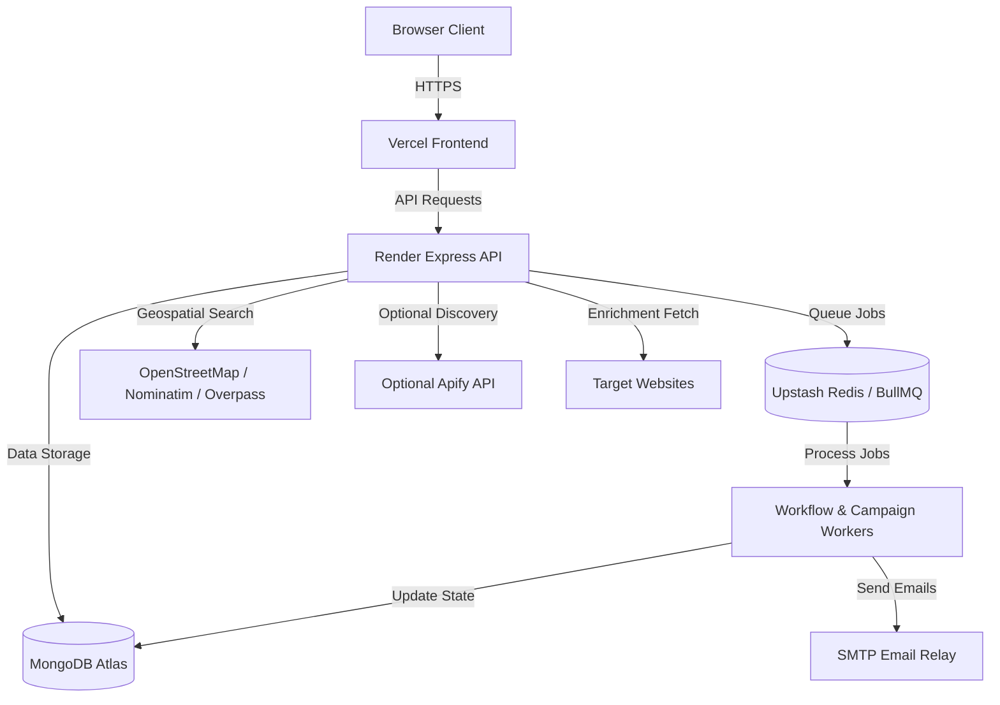

# LeadFlow

LeadFlow is an omnichannel lead generation and workflow automation platform that helps users discover prospects, enrich business information, manage leads, create email campaigns, and automate actions through visual workflows. It combines prospecting, CRM, and workflow execution into a single unified system.

## Live Demo

- **Application**: [https://lead-flow-nine-lyart.vercel.app](https://lead-flow-nine-lyart.vercel.app)
- **Repository**: [https://github.com/anideva/LeadFlow](https://github.com/anideva/LeadFlow)
- **Backend Health**: [https://leadflow-e9m2.onrender.com/api/health](https://leadflow-e9m2.onrender.com/api/health)

The health endpoint provides real-time status for the Express API, MongoDB database connection, Redis connectivity, BullMQ job queues, and background workers. Note that the health check is a diagnostic endpoint, while the main application demo is available at the application link above.

## Features

- User registration and login with secure HTTP-only cookies and optional Google Sign-In
- Workspace-based multi-tenancy and data isolation
- Lead discovery using OpenStreetMap, Nominatim, and Overpass APIs
- Website enrichment extracting public email addresses, phone numbers, and social links
- Lead management with pipeline stages (`new`, `contacted`, `qualified`, `converted`, `lost`)
- Search, filtering, priority tagging, and pagination
- Lead archive and bulk operations
- CSV import and RFC 4180 compliant CSV export
- Reusable email templates with validated placeholders (`{{firstName}}`, `{{company}}`, etc.)
- Campaign management with asynchronous email dispatch
- Background campaign processing via BullMQ and Redis
- Visual workflow builder with trigger, condition, and action nodes
- Workflow execution history and execution logging
- In-process Redis and BullMQ background workers
- System health and queue monitoring
- Optional Apify Google Maps discovery with workspace usage limits
- Server-side request forgery (SSRF) protections around website enrichment

## How LeadFlow Works

1. **Register and Access Workspace**: A user creates an account and immediately accesses their dedicated workspace where all data is segregated.
2. **Access Workspace**: The user enters their dedicated workspace where all data is segregated.
3. **Discover Prospects**: The user searches for local businesses or prospective companies by location and category.
4. **Enrich Details**: Discovered prospects can be enriched by scanning their public websites for emails, phone numbers, and social profiles.
5. **Save to Leads**: Selected prospects are saved into the workspace lead database with a single click.
6. **Organize Pipeline**: Leads can be searched, filtered, prioritized, updated across pipeline stages, or exported to CSV.
7. **Create Email Templates**: Users build dynamic email templates containing variable tags for personalized outreach.
8. **Launch Campaigns**: Leads are enrolled into email campaigns and dispatched asynchronously through background queues.
9. **Build Workflows**: Users create visual automation graphs with custom conditions (e.g., checking lead properties) and automated actions (e.g., sending an email or updating lead status).
10. **Background Execution**: Background workers process campaign dispatches and workflow steps via BullMQ and Redis.

## Architecture


```mermaid
graph TD
    Browser[Browser Client]
    Vercel[Vercel Frontend]
    API[Render Express API]
    Mongo[(MongoDB Atlas)]
    Redis[(Upstash Redis / BullMQ)]
    Workers[Workflow & Campaign Workers]

    OSM[OpenStreetMap / Nominatim / Overpass]
    Apify[Optional Apify API]
    Web[Target Websites]
    SMTP[SMTP Email Relay]

    Browser -->|HTTPS| Vercel
    Vercel -->|API Requests| API
    API -->|Data Storage| Mongo
    API -->|Queue Jobs| Redis
    Redis -->|Process Jobs| Workers
    Workers -->|Update State| Mongo
    Workers -->|Send Emails| SMTP

    API -->|Geospatial Search| OSM
    API -->|Optional Discovery| Apify
    API -->|Enrichment Fetch| Web
```

For detailed architecture, component boundaries, and request flows, see:
[Architecture Documentation](docs/ARCHITECTURE.md)

## Tech Stack

| Area | Technology |
|---|---|
| Frontend | React, TypeScript, Vite |
| UI / Workflow Editor | React Flow (`@xyflow/react`) |
| Backend | Node.js, Express, TypeScript |
| Database | MongoDB, Mongoose |
| Authentication | JWT, HTTP-only cookies, bcryptjs |
| Background Jobs | BullMQ, Redis (ioredis) |
| Lead Discovery | OpenStreetMap, Nominatim, Overpass API, optional Apify |
| Email | Nodemailer, SMTP |
| Frontend Hosting | Vercel |
| Backend Hosting | Render |
| Database Hosting | MongoDB Atlas |
| Redis Hosting | Upstash Redis |

## Project Structure

```text
LeadFlow/
├── client/          # Frontend application (React, Vite, TypeScript)
│   └── src/
├── server/          # Backend REST API and background workers (Express, BullMQ, Mongoose)
│   └── src/
├── docs/            # Technical specifications and system documentation
│   ├── ARCHITECTURE.md
│   ├── ER_DIAGRAM.md
│   └── TECHNICAL_DOCUMENTATION.md
├── package.json     # Root development scripts
└── README.md
```

- `client/`: Single-page application source code and UI components.
- `server/`: Express API server, database models, business logic, queues, and background workers.
- `docs/`: In-depth documentation covering system architecture, database design, and technical details.

## Getting Started

### Prerequisites

- **Node.js**: v20.x or later
- **npm**: v9.x or later
- **MongoDB**: A running local MongoDB instance (`mongodb://127.0.0.1:27017/leadflow`) or a MongoDB Atlas connection URI
- **Redis**: A local Redis instance (`127.0.0.1:6379`) or a cloud Redis service (such as Upstash) for background queue processing

## Run Locally

Follow these steps if you want to run LeadFlow on your own computer instead of using the live demo.

### 1. Clone the repository

Open PowerShell, Command Prompt, or terminal:

```bash
git clone https://github.com/anideva/LeadFlow.git
cd LeadFlow
```

### 2. Install backend dependencies

From the project root:

```bash
cd server
npm install
```

### 3. Configure the backend

Create the environment file:

```bash
# Windows (PowerShell)
Copy-Item .env.example .env

# macOS / Linux
cp .env.example .env
```

Open `server/.env` and configure your MongoDB, Redis, JWT, SMTP, and other required variables.

Key environment variables:

- `PORT`: Server listening port (default: `5000`)
- `NODE_ENV`: Runtime environment (`development` or `production`)
- `CLIENT_URL`: Allowed frontend origin for CORS and cookies (e.g., `http://localhost:5173`)
- `MONGODB_URI`: MongoDB connection string
- `JWT_SECRET`: Secret key used for signing JWT tokens (minimum 32 characters)
- `JWT_EXPIRES_IN`: JWT expiration duration (e.g., `7d`)
- `EMAIL_HOST`, `EMAIL_PORT`, `EMAIL_SECURE`, `EMAIL_USER`, `EMAIL_PASSWORD`, `EMAIL_FROM_NAME`, `EMAIL_FROM_ADDRESS`: SMTP server settings for email verification and campaigns
- `REDIS_HOST`, `REDIS_PORT`, `REDIS_PASSWORD`, `REDIS_TLS`: Redis connection parameters for BullMQ queues
- `DISCOVERY_PROVIDER`: Discovery engine mode (`osm_combined`, `openstreetmap`, `overpass`, or `development`)
- `OVERPASS_BASE_URL`: Overpass API interpreter endpoint
- `OSM_USER_AGENT`: User-Agent header for OpenStreetMap queries
- `APIFY_ENABLED`, `APIFY_API_TOKEN`, `APIFY_ACTOR_ID`, `APIFY_MAX_RESULTS`, `APIFY_MAX_RUNS_PER_WORKSPACE_PER_DAY`: Optional Apify Google Maps configuration

> Never commit `.env` files or real credentials to source control.

### 4. Start the backend

Still inside the `server` folder:

```bash
npm run dev
```

You should see the backend running on:
[http://localhost:5000](http://localhost:5000)

Keep this terminal open.

### 5. Open a second terminal for the frontend

Open another terminal window, navigate to the project directory, and start the client:

```bash
cd client
npm install
npm run dev
```

The frontend will be available at:
[http://localhost:5173](http://localhost:5173)

### 6. Open LeadFlow

Open your browser and visit:
[http://localhost:5173](http://localhost:5173)

The frontend will communicate with your local backend at:
[http://localhost:5000](http://localhost:5000) (and health diagnostics are available at [http://localhost:5000/api/health](http://localhost:5000/api/health)).

### Run frontend and backend from the project root

If the dependencies are already installed, you can use two terminals from the root directory:

Terminal 1:

```bash
npm run server:dev
```

Terminal 2:

```bash
npm run client:dev
```

## Database Design

LeadFlow uses MongoDB with Mongoose schemas and compound indexes to enforce workspace-level multi-tenancy.

The primary database entities include:

- **Workspace**: Tenant root defining organizational ownership and settings
- **User**: User accounts associated with a workspace, roles, and verification status
- **Lead**: CRM leads with contact details, pipeline status, and enrichment provenance
- **EmailTemplate**: Reusable HTML/text outreach email templates
- **Campaign**: Outreach campaigns linked to email templates
- **CampaignLead**: Association junction tracking individual lead delivery status in campaigns
- **Workflow**: Directed acyclic graph (DAG) automation definitions
- **WorkflowExecution**: Run history and node-by-node execution logs
- **WorkspaceUsage**: Daily quota tracking for external provider operations

For the complete schema definitions, relationships, and index specifications, see:
[ER Diagram & Database Design](docs/ER_DIAGRAM.md)

## Testing

Automated test suites can be run from the `server` directory:

```bash
cd server

# Run the complete test suite (all suites sequentially)
npm test

# Run individual test suites
npm run test:discovery          # OpenStreetMap and Overpass lead discovery tests
npm run test:apify              # Apify provider contract and normalization tests
npm run test:apify:usage        # Workspace daily usage limit and cost protection tests
npm run test:auth:verification  # Authentication and email verification tests
npm run test:auth:google        # Supabase Google OAuth and account linking tests
```

The current automated test suite includes 99 passing tests across all five test suites.

## Deployment

The production deployment consists of:

- **Frontend**: Hosted on Vercel at [https://lead-flow-nine-lyart.vercel.app](https://lead-flow-nine-lyart.vercel.app) with proxy configuration in `client/vercel.json`.
- **Backend API**: Hosted on Render at [https://leadflow-e9m2.onrender.com](https://leadflow-e9m2.onrender.com). In production, BullMQ background workers run in-process with the Express service to manage resource limits efficiently.
- **Database**: MongoDB Atlas cloud cluster.
- **Queue Storage**: Upstash Redis serverless instance.

The application communicates with external services including MongoDB, Redis, configured SMTP servers, and OpenStreetMap/Overpass endpoints.

## Current Limitations

- **Render Cold Starts**: On Render's free tier, the web service enters sleep mode after periods of inactivity. An initial request after dormancy may take 30–45 seconds to wake up the service.
- **Public API Rate Limits**: OpenStreetMap, Nominatim, and Overpass are shared community services subject to public rate limits and usage policies.
- **Email Delivery Dependencies**: Outreach campaigns and email actions depend on the configuration, deliverability, and reputation of the configured SMTP provider.
- **Static Website Parsing**: Website enrichment reads public static HTML. Single-page applications that rely heavily on client-side JavaScript rendering may yield limited contact information.
- **Optional Apify Provider**: Apify Google Maps integration is optional and constrained by account balance, API tokens, and daily workspace run limits.

## Future Improvements

The following improvements are planned for future iterations:

- Email verification: Re-enable email verification with a production SMTP/transactional email provider once the application's email infrastructure is configured.
- Separate dedicated background worker deployments from the main API service.
- Additional email delivery providers and delivery rate tracking.
- Additional prospect discovery sources and providers.
- Headless browser rendering during website enrichment for JavaScript-rendered sites.
- Advanced campaign scheduling, timezone-aware dispatch, and engagement analytics.
- Additional workflow node types, conditional operators, and external webhook triggers.
- Granular role-based access control (RBAC) within workspaces.
- Centralized application metrics, error tracking, and queue monitoring dashboards.
- Automated CI/CD pipelines with integrated test runs.
- End-to-end integration test coverage.

## Documentation

- [Architecture](docs/ARCHITECTURE.md) - System architecture, component relationships, and data flow diagrams.
- [ER Diagram & Database Design](docs/ER_DIAGRAM.md) - Database schemas, relationship models, and index structures.
- [Technical Documentation](docs/TECHNICAL_DOCUMENTATION.md) - Comprehensive technical manual covering API endpoints, background jobs, and security mechanisms.

## License

No license has been specified for this repository.
