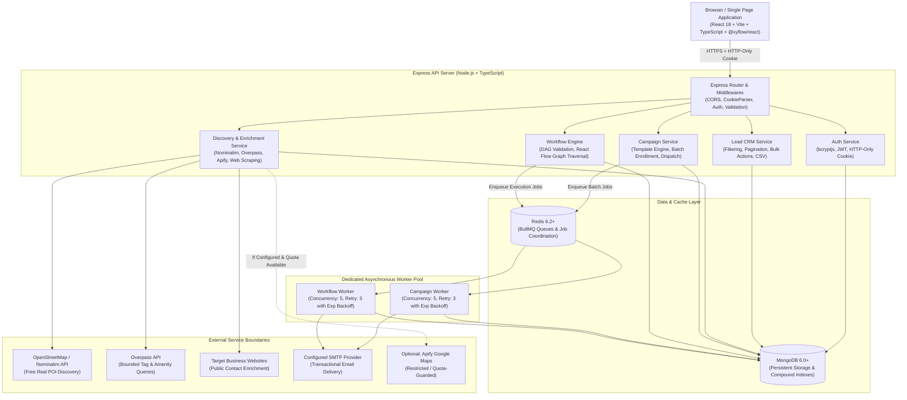
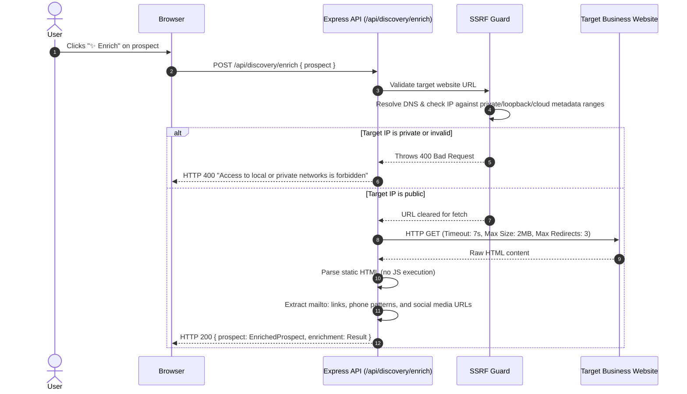
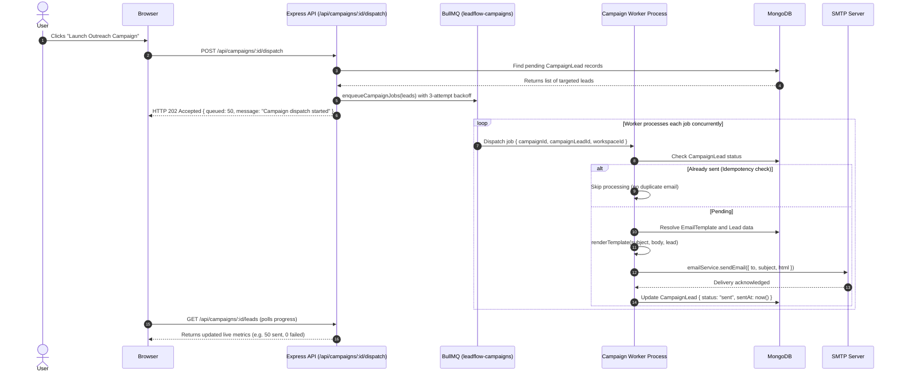
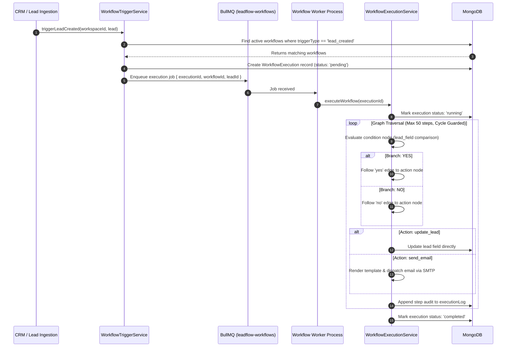

# LeadFlow — System Architecture & Component Design

This document details the architectural design, component interactions, request pipelines, and operational boundaries of the LeadFlow V1 platform.

---

## 1. High-Level System Architecture

LeadFlow is built as a modular, decoupled full-stack application with asynchronous background processing and strict multi-tenant boundary enforcement.



### ASCII High-Level Architecture Diagram
```text
  +-----------------------------------------------------------------------+
  |              React Single Page Application (Vite + TS)                |
  |    (CRM Dashboard, Discovery UI, Template Editor, React Flow Canvas)  |
  +-----------------------------------------------------------------------+
                                      |
                     HTTPS Requests / HTTP-Only JWT Cookie
                                      v
  +-----------------------------------------------------------------------+
  |                   Express API Server (Port 5000)                      |
  |  +--------------------+---------------------+----------------------+  |
  |  |  Auth & Workspaces |   Lead CRM Engine   | Discovery & Enrich   |  |
  |  |  Campaign Manager  |   Workflow Engine   | System Health Check  |  |
  |  +--------------------+---------------------+----------------------+  |
  +-----------------------------------------------------------------------+
              |                                            |
       CRUD Operations                             Job Enqueueing
              v                                            v
  +-----------------------+                    +-----------------------+
  |        MongoDB        |                    |         Redis         |
  |  (Tenants, Leads,     |                    | (leadflow-workflows,  |
  |   Campaigns, Graphs)  |                    |  leadflow-campaigns)  |
  +-----------------------+                    +-----------------------+
              ^                                            |
              |                                     Job Dispatch
              |                                            v
              |               +-------------------------------------------+
              +---------------|          Background Worker Pool           |
                              |  - Workflow Worker (DAG execution, email) |
                              |  - Campaign Worker (batch SMTP dispatch)  |
                              +-------------------------------------------+
                                                           |
                                                   Outbound Delivery
                                                           v
                                              +---------------------------+
                                              | Configured SMTP Provider  |
                                              +---------------------------+
```

---

## 2. Core Request & Data Flows

### 2.1. Authentication & Session Management Flow
LeadFlow enforces enterprise-standard token management via HTTP-only, SameSite cookies. Access tokens are never stored in `localStorage` or exposed to JavaScript.

```mermaid
sequenceDiagram
    autonumber
    actor User
    participant Browser
    participant Express as Express API (/api/auth)
    participant Mongo as MongoDB (User Collection)

    User->>Browser: Enters email and password
    Browser->>Express: POST /api/auth/login { email, password }
    Express->>Mongo: User.findOne({ email })
    Mongo-->>Express: Returns user record with passwordHash
    Express->>Express: bcrypt.compare(password, passwordHash)
    Express->>Express: jwt.sign({ userId, workspaceId }, JWT_SECRET, { expiresIn: '7d' })
    Express-->>Browser: Set-Cookie: leadflow_token=<jwt>; HttpOnly; SameSite=Lax<br/>HTTP 200 { success: true, user }
    Browser->>User: Renders CRM Dashboard
    Note over Browser, Express: Subsequent requests automatically include the HTTP-only cookie
```

### 2.2. Lead Discovery & Research Flow
LeadFlow provides a decoupled, pluggable discovery architecture supporting both free OpenStreetMap engines and optional, quota-protected third-party providers.

```mermaid
sequenceDiagram
    autonumber
    actor User
    participant Browser
    participant API as Express API (/api/discovery/search)
    participant Usage as WorkspaceUsageService
    participant Engine as Discovery Engine
    participant OSM as OpenStreetMap / Overpass

    User->>Browser: Enters query ("Bakeries in Jaipur")
    Browser->>API: POST /api/discovery/search { query, provider: "osm_combined" }
    API->>API: Authenticate user & extract workspaceId
    
    alt Provider is Free Discovery (osm_combined)
        API->>Engine: CompositeDiscoveryProvider.search()
        Engine->>OSM: Query Nominatim geocoder & Overpass POI interpreter
        OSM-->>Engine: Raw geospatial nodes & tags
        Engine->>Engine: Normalize & Deduplicate into DiscoveredProspect[]
        Engine-->>API: Returns prospects (real listings, zero fabrication)
    else Provider is Apify Google Maps (Experimental)
        API->>Usage: reserveDailyRun(workspaceId)
        Usage->>Usage: Atomic findOneAndUpdate({ count < 10 }, { $inc: 1 })
        alt Daily limit reached
            Usage-->>API: allowed: false
            API-->>Browser: HTTP 429 APIFY_WORKSPACE_DAILY_LIMIT_EXCEEDED
            Browser->>User: Displays Cost Protection banner; keeps provider as Apify
        else Quota available
            Usage-->>API: allowed: true
            API->>Engine: ApifyDiscoveryProvider.search()
            Engine-->>API: Normalized Google Places results
        end
    end

    API-->>Browser: HTTP 200 { success: true, prospects: [...] }
```

### 2.3. Free Website Enrichment Flow (SSRF-Safe)
Inspects a discovered prospect's official website to extract publicly published business contacts without paid APIs.



### 2.4. Asynchronous Campaign Dispatch Flow
Outreach campaigns are processed asynchronously via BullMQ queues, providing immediate HTTP 202 responses while background workers dispatch personalized emails.



### 2.5. Workflow Automation Engine Flow
Deterministic graph traversal driven by lead lifecycle events (`lead_created`, `lead_updated`, `manual`).



---

## 3. Component Responsibilities

| Subsystem | Key Technologies | Primary Responsibility |
| :--- | :--- | :--- |
| **Frontend UI** | React 18, Vite, TypeScript, `@xyflow/react` | Single-page application providing the CRM table, natural language discovery search, email template editor, campaign launcher, and visual node-based workflow editor. |
| **API Layer** | Express 4, TypeScript, CookieParser, CORS | Exposes REST endpoints, validates inputs, verifies JWT auth cookies, enforces workspace isolation, and translates internal exceptions into standardized HTTP error responses. |
| **CRM Engine** | Mongoose, MongoDB | Manages leads, custom fields, pipeline statuses, priority triages, soft-deletion (`isArchived`), and multi-tenant compound indexes. |
| **Discovery Engine** | OpenStreetMap Nominatim, Overpass API, Apify | Natural language query parsing, geographic location extraction, bounded POI search, deduplication, and normalized prospect synthesis. |
| **Enrichment Engine** | Node.js `dns`, native `fetch` | Server-Side Request Forgery (SSRF) guarded website scraper extracting emails, phone numbers, and official social media profile links from static HTML. |
| **Queue Manager** | BullMQ 6, Redis 6+ | Asynchronous task queueing, bounded retry management with exponential backoff, job deduplication, and memory retention controls. |
| **Worker Pool** | Standalone Node.js processes | Independent workers executing campaign email dispatches and workflow graph traversals without blocking the Express HTTP thread. |
| **Email Infrastructure** | Nodemailer, SMTP | Abstracted provider layer (`IEmailProvider`) handling variable interpolation, RFC compliance, and secure TLS email transmission. |

---

## 4. Architectural Decisions & Technical Rationale

### 1. Free-First Architecture
- **Decision**: Default discovery and enrichment rely exclusively on open-source, zero-cost services (OpenStreetMap Nominatim under ODbL 1.0, public Overpass API, and native website HTML inspection).
- **Rationale**: Enables zero-budget local testing, developer onboarding without credit card requirements, and zero vendor lock-in.

### 2. Multi-Tenant Workspace Boundary
- **Decision**: Every persistent document (except global user logins) carries a mandatory `workspaceId` field backed by compound indexes (e.g. `{ workspaceId: 1, isArchived: 1, createdAt: -1 }`).
- **Rationale**: Strictly guarantees data isolation between organizations. Controller routes read `workspaceId` solely from verified JWT tokens, preventing IDOR (Insecure Direct Object Reference) vulnerabilities.

### 3. Asynchronous Job Delegation (HTTP 202 Accepted)
- **Decision**: Batch email campaigns and multi-step workflow graphs are queued into Redis/BullMQ and return HTTP 202 immediately to the client.
- **Rationale**: Eliminates HTTP connection timeouts, isolates email gateway latency from user navigation, and allows workers to scale independently of the web tier.

### 4. Deterministic Graph Validation
- **Decision**: React Flow on the frontend is treated purely as a visualization tool; the backend strictly re-validates the entire graph topology on every save.
- **Rationale**: Prevents infinite execution loops via Depth-First Search (DFS) cycle detection, guarantees single-trigger integrity, and enforces strict schema compliance on node parameters.

### 5. Two-Tier Rate Limiting & Cost Protection
- **Decision**: If optional third-party engines (such as Apify) are enabled, they are protected by an atomic MongoDB daily run counter (`WorkspaceUsageService`) backed by an in-memory session ceiling.
- **Rationale**: Eliminates race conditions during concurrent searches and guarantees that no team or workspace can run up unbudgeted third-party cloud costs.
