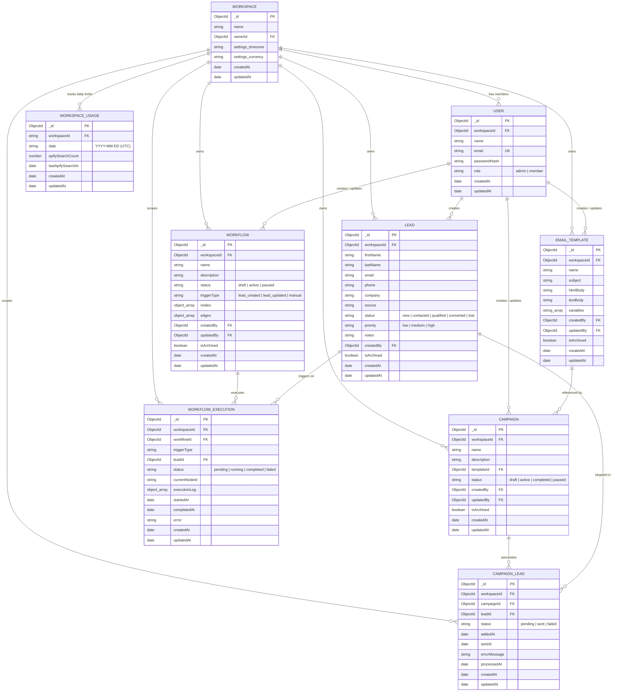

# LeadFlow — Entity Relationship (ER) & Database Architecture

This document defines the complete, production-verified database architecture for LeadFlow V1. All entities, fields, relationships, and indexes documented here are directly derived from the production Mongoose schemas in `server/src/models/`.

---

## 1. High-Level Entity Relationship Model

```text
┌────────────────────────────────────────────────────────────────────────┐
│                              Workspace                                 │
│               (Tenant boundary for multi-tenant isolation)              │
└───────┬──────────────┬──────────────┬──────────────┬──────────────┬────┘
        │ 1:N          │ 1:N          │ 1:N          │ 1:N          │ 1:N
        ▼              ▼              ▼              ▼              ▼
     ┌──────┐      ┌──────┐     ┌───────────┐   ┌─────────┐   ┌──────────────┐
     │ User │      │ Lead │     │   Email   │   │Workflow │   │WorkspaceUsage│
     └──────┘      └───┬──┘     │ Template  │   └────┬────┘   └──────────────┘
                       │        └─────┬─────┘        │ 1:N
                       │              │              ▼
                       │              │ 1:N     ┌───────────────────┐
                       │              ▼         │ WorkflowExecution │
                       │        ┌──────────┐    └───────────────────┘
                       │        │ Campaign │
                       │        └─────┬────┘
                       │              │ 1:N
                       │ 1:N          ▼
                       │        ┌──────────────┐
                       └───────►│ CampaignLead │ (Junction / Association)
                                └──────────────┘
```

---

## 2. Mermaid ER Diagram



---

## 3. ASCII Fallback ER Diagram

```text
+------------------------------------------------------------------------+
|                               WORKSPACE                                |
|------------------------------------------------------------------------|
| * _id: ObjectId [PK]                                                   |
|   name: String(100)                                                    |
|   ownerId: ObjectId [FK -> USER._id]                                   |
|   settings: { timezone: String, currency: String }                     |
|   createdAt: Date                                                      |
|   updatedAt: Date                                                      |
+------------------------------------------------------------------------+
       |               |               |               |            |
       | 1:N           | 1:N           | 1:N           | 1:N        | 1:N
       v               v               v               v            v
+-------------+ +-------------+ +-------------+ +-------------+ +---------------+
|    USER     | |    LEAD     | |EMAIL_TEMPLATE| |  WORKFLOW   | |WORKSPACE_USAGE|
|-------------| |-------------| |-------------| |-------------| |---------------|
| * _id [PK]  | | * _id [PK]  | | * _id [PK]  | | * _id [PK]  | | * _id [PK]    |
|   workspaceId |   workspaceId |   workspaceId |   workspaceId |   workspaceId |
|   [FK]      | |   [FK]      | |   [FK]      | |   [FK]      | |   [FK]        |
|   name      | |   firstName | |   name      | |   name      | |   date (UTC)  |
|   email [UK]| |   lastName  | |   subject   | |   description| |   apifyCount  |
|   passHash  | |   email     | |   htmlBody  | |   status    | |   lastSearchAt|
|   role      | |   phone     | |   textBody  | |   triggerType| +---------------+
+-------------+ |   company   | |   variables | |   nodes []  |
                |   source    | |   createdBy | |   edges []  |
                |   status    | |   updatedBy | |   createdBy |
                |   priority  | |   isArchived| |   updatedBy |
                |   notes     | +-------------+ |   isArchived|
                |   createdBy |        |        +-------------+
                |   isArchived|        | 1:N           |
                +-------------+        v               | 1:N
                       |        +-------------+        v
                       |        |  CAMPAIGN   | +-------------------+
                       |        |-------------| |WORKFLOW_EXECUTION |
                       |        | * _id [PK]  | |-------------------|
                       |        |   workspaceId| | * _id [PK]        |
                       |        |   templateId| |   workspaceId [FK]|
                       |        |   [FK]      | |   workflowId [FK] |
                       |        |   name      | |   leadId [FK]     |
                       |        |   status    | |   triggerType     |
                       |        |   createdBy | |   status          |
                       |        |   updatedBy | |   executionLog [] |
                       |        |   isArchived| |   startedAt       |
                       |        +-------------+ |   completedAt     |
                       |               |        |   error           |
                       | 1:N           | 1:N    +-------------------+
                       v               v
                +-----------------------------+
                |        CAMPAIGN_LEAD        |
                |-----------------------------|
                | * _id: ObjectId [PK]        |
                |   workspaceId: ObjectId [FK]|
                |   campaignId: ObjectId [FK] |
                |   leadId: ObjectId [FK]     |
                |   status: pending|sent|fail |
                |   addedAt: Date             |
                |   sentAt: Date              |
                |   errorMessage: String      |
                |   processedAt: Date         |
                | * UNIQUE(campaignId, leadId)|
                +-----------------------------+
```

---

## 4. Entity Specifications & Schema Catalog

### 4.1. Workspace (`Workspace.model.ts`)
The root multi-tenant isolation container. Every persistent entity (except global user accounts) is scoped to a workspace.
- **Fields**:
  - `_id` (`ObjectId`, PK): Unique workspace identifier.
  - `name` (`String`, required, max: 100): Organization or team display name.
  - `ownerId` (`ObjectId`, optional, ref: `User`): The user who owns the workspace.
  - `settings.timezone` (`String`, default: `'UTC'`): Timezone for schedule calculations.
  - `settings.currency` (`String`, default: `'USD'`): Currency configuration.
  - `createdAt`, `updatedAt` (`Date`): Managed by Mongoose `timestamps: true`.
- **Indexes**: Default `_id` primary key.

### 4.2. User (`User.model.ts`)
User account with credential security and workspace membership.
- **Fields**:
  - `_id` (`ObjectId`, PK): Unique user identifier.
  - `workspaceId` (`ObjectId`, required, ref: `Workspace`, index: true): Associated tenant workspace.
  - `name` (`String`, required, max: 100): User's full name.
  - `email` (`String`, required, lowercase, unique, index: true): Login address.
  - `passwordHash` (`String`, required): 12-round bcrypt hash.
  - `role` (`String`, enum: `['admin', 'member']`, default: `'admin'`): Access level.
  - `createdAt`, `updatedAt` (`Date`): Managed by `timestamps: true`.
- **Indexes**:
  - `{ email: 1 }` (unique): Prevents duplicate accounts globally.
  - `{ workspaceId: 1 }`: Fast tenant user lookups.

### 4.3. Lead (`Lead.model.ts`)
The core CRM entity representing prospective customers, clients, or organizations.
- **Fields**:
  - `_id` (`ObjectId`, PK): Unique lead identifier.
  - `workspaceId` (`ObjectId`, required, ref: `Workspace`, index: true): Multi-tenant boundary.
  - `firstName` (`String`, required, max: 100): First name or business title.
  - `lastName` (`String`, optional, max: 100): Last name or contact person.
  - `email` (`String`, optional, lowercase): Contact email (validated on format).
  - `phone` (`String`, optional): Contact telephone.
  - `company` (`String`, optional, max: 150): Organization or business name.
  - `source` (`String`, default: `'manual'`): Discovery origin (`'manual'`, `'csv'`, `'discovery'`, `'apify_google_maps'`).
  - `status` (`String`, enum: `['new', 'contacted', 'qualified', 'converted', 'lost']`, default: `'new'`): Pipeline stage.
  - `priority` (`String`, enum: `['low', 'medium', 'high']`, default: `'medium'`): Urgency level.
  - `notes` (`String`, optional, max: 2000): Rich provenance context, coordinates, and description.
  - `createdBy` (`ObjectId`, required, ref: `User`, index: true): Author identifier.
  - `isArchived` (`Boolean`, default: `false`, index: true): Soft-delete flag.
  - `createdAt`, `updatedAt` (`Date`): Managed by `timestamps: true`.
- **Compound Indexes**:
  - `{ workspaceId: 1, isArchived: 1, createdAt: -1 }`: Primary pipeline sorting and pagination.
  - `{ workspaceId: 1, email: 1 }`: Fast email deduplication within the tenant.
  - `{ workspaceId: 1, status: 1 }`: Pipeline stage filtering.
  - `{ workspaceId: 1, priority: 1 }`: Priority triage filtering.

### 4.4. EmailTemplate (`EmailTemplate.model.ts`)
Reusable HTML/text email content with placeholder interpolation.
- **Fields**:
  - `_id` (`ObjectId`, PK): Unique template identifier.
  - `workspaceId` (`ObjectId`, required, ref: `Workspace`, index: true): Tenant scope.
  - `name` (`String`, required, max: 150): Friendly template name.
  - `subject` (`String`, required, max: 300): Email subject line (supports `{{variable}}`).
  - `htmlBody` (`String`, required): Email body formatted as HTML.
  - `textBody` (`String`, optional): Fallback plain text representation.
  - `variables` (`[String]`, default: `[]`): Extracted list of supported placeholders (`firstName`, `email`, etc.).
  - `createdBy` (`ObjectId`, required, ref: `User`, index: true): Template author.
  - `updatedBy` (`ObjectId`, required, ref: `User`): Last modified by.
  - `isArchived` (`Boolean`, default: `false`, index: true): Soft-delete flag.
- **Compound Indexes**:
  - `{ workspaceId: 1, isArchived: 1, createdAt: -1 }`: Workspace listing.
  - `{ workspaceId: 1, isArchived: 1, name: 1 }`: Alphabetical search.

### 4.5. Campaign (`Campaign.model.ts`)
Marketing or sales outreach initiative associating an email template with a cohort of leads.
- **Fields**:
  - `_id` (`ObjectId`, PK): Unique campaign identifier.
  - `workspaceId` (`ObjectId`, required, ref: `Workspace`, index: true): Tenant boundary.
  - `name` (`String`, required, max: 150): Campaign name.
  - `description` (`String`, optional, max: 1000): Campaign notes or objective.
  - `templateId` (`ObjectId`, required, ref: `EmailTemplate`, index: true): Referenced template.
  - `status` (`String`, enum: `['draft', 'active', 'completed', 'paused']`, default: `'draft'`, index: true).
  - `createdBy`, `updatedBy` (`ObjectId`, required, ref: `User`).
  - `isArchived` (`Boolean`, default: `false`, index: true): Soft-delete flag.
- **Compound Indexes**:
  - `{ workspaceId: 1, isArchived: 1, createdAt: -1 }`: Dashboard chronological listing.
  - `{ workspaceId: 1, isArchived: 1, status: 1 }`: Lifecycle filtering.
  - `{ workspaceId: 1, templateId: 1 }`: Dependency validation.

### 4.6. CampaignLead (`CampaignLead.model.ts`)
Junction model linking Leads to Campaigns, tracking per-lead delivery state and error telemetry.
- **Fields**:
  - `_id` (`ObjectId`, PK): Unique association identifier.
  - `workspaceId` (`ObjectId`, required, ref: `Workspace`, index: true): Tenant scope.
  - `campaignId` (`ObjectId`, required, ref: `Campaign`, index: true): Associated campaign.
  - `leadId` (`ObjectId`, required, ref: `Lead`, index: true): Targeted lead.
  - `status` (`String`, enum: `['pending', 'sent', 'failed']`, default: `'pending'`, index: true).
  - `addedAt` (`Date`, default: `Date.now`): Association timestamp.
  - `sentAt` (`Date`, optional): Delivery completion timestamp.
  - `errorMessage` (`String`, optional): Sanitized failure description if dispatch failed.
  - `processedAt` (`Date`, optional): Worker execution timestamp.
- **Compound Indexes**:
  - `{ campaignId: 1, leadId: 1 }` (unique): Strictly prevents duplicate enrollment of the same lead in a campaign.
  - `{ workspaceId: 1, campaignId: 1, status: 1 }`: Worker batch querying and UI stats calculation.

### 4.7. Workflow (`Workflow.model.ts`)
Deterministic automation definition storing graph nodes and edges (validated as a Directed Acyclic Graph).
- **Fields**:
  - `_id` (`ObjectId`, PK): Unique workflow identifier.
  - `workspaceId` (`ObjectId`, required, ref: `Workspace`, index: true): Tenant scope.
  - `name` (`String`, required, max: 150): Workflow name.
  - `description` (`String`, optional, max: 1000): Workflow description.
  - `status` (`String`, enum: `['draft', 'active', 'paused']`, default: `'draft'`, index: true).
  - `triggerType` (`String`, enum: `['lead_created', 'lead_updated', 'manual']`, required, index: true).
  - `nodes` (`[IWorkflowNode]`, required): Array of graph nodes (`id`, `type`, `position`, `data`).
  - `edges` (`[IWorkflowEdge]`, required): Array of graph edges (`id`, `source`, `target`, `sourceHandle`).
  - `createdBy`, `updatedBy` (`ObjectId`, required, ref: `User`).
  - `isArchived` (`Boolean`, default: `false`, index: true): Soft-delete flag.
- **Compound Indexes**:
  - `{ workspaceId: 1, isArchived: 1, createdAt: -1 }`: Workflow listing.
  - `{ workspaceId: 1, status: 1, triggerType: 1 }`: Event-driven trigger matching engine.

### 4.8. WorkflowExecution (`WorkflowExecution.model.ts`)
Audit log and execution state for a specific workflow traversal against a lead.
- **Fields**:
  - `_id` (`ObjectId`, PK): Unique execution run identifier.
  - `workspaceId` (`ObjectId`, required, ref: `Workspace`, index: true): Tenant scope.
  - `workflowId` (`ObjectId`, required, ref: `Workflow`, index: true): Executed workflow.
  - `leadId` (`ObjectId`, required, ref: `Lead`, index: true): Target lead context.
  - `triggerType` (`String`, required): Trigger event that started the run.
  - `status` (`String`, enum: `['pending', 'running', 'completed', 'failed']`, default: `'pending'`, index: true).
  - `currentNodeId` (`String`, optional): Node being processed.
  - `executionLog` (`[IWorkflowExecutionStep]`): Audit trail containing node step statuses, evaluation details, and timestamps.
  - `startedAt`, `completedAt` (`Date`): Execution timing.
  - `error` (`String`, optional): Root cause if execution aborted.
- **Compound Indexes**:
  - `{ workspaceId: 1, workflowId: 1, createdAt: -1 }`: Workflow execution history tab.
  - `{ workspaceId: 1, leadId: 1 }`: Lead timeline view.
  - `{ workspaceId: 1, status: 1 }`: Failure monitor.

### 4.9. WorkspaceUsage (`WorkspaceUsage.model.ts`)
Atomic daily rate limiting and cost protection tracking per tenant workspace.
- **Fields**:
  - `_id` (`ObjectId`, PK): Internal record identifier.
  - `workspaceId` (`String`, required, index: true): Tenant workspace identifier.
  - `date` (`String`, required, index: true): UTC date in `YYYY-MM-DD` format.
  - `apifySearchCount` (`Number`, required, default: 0, min: 0): Searches executed today.
  - `lastApifySearchAt` (`Date`, optional): Timestamp of last outbound discovery call.
- **Compound Indexes**:
  - `{ workspaceId: 1, date: 1 }` (unique): Ensures atomic one-document-per-day concurrency guarantees.

---

## 5. Multi-Tenant Isolation & Data Integrity Rules

1. **Strict Tenant Scoping**: All queries from authenticated routes include `workspaceId: req.user.workspaceId`. Users can never read, modify, or associate records across workspace boundaries.
2. **Cross-Tenant Association Validation**: When associating an `EmailTemplate` to a `Campaign`, or a `Lead` to a `CampaignLead`, the backend explicitly validates that both entities share the identical `workspaceId`.
3. **Soft-Deletion Pattern**: `isArchived: true` is enforced across `Lead`, `Campaign`, `EmailTemplate`, and `Workflow`. Archived entities are filtered out from default queries (`isArchived: false`) but remain preserved for historical audit trails.
4. **Idempotent Constraints**:
   - `CampaignLead`: `{ campaignId: 1, leadId: 1 }` (unique) prevents duplicate email dispatch to the same lead in a campaign.
   - `WorkspaceUsage`: `{ workspaceId: 1, date: 1 }` (unique) prevents multiple rate-limit counters from being created on the same day.
